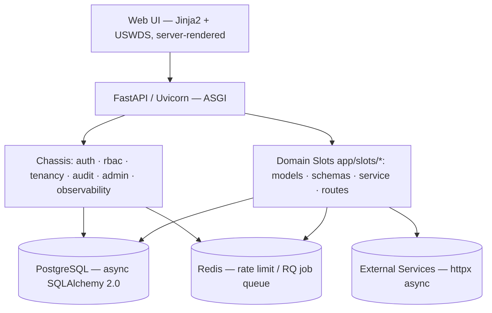
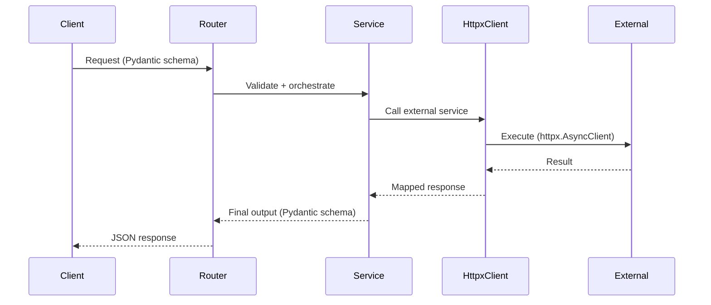

# {{PROJECT_NAME}} — Design
<!-- @owned-by:  | @role: system | @system-derives-from:  | @locked-by-chassis: true -->
## Platform Chassis — AI-Executable Design Specification (Python 3.12 · FastAPI · SQLAlchemy 2.0 async)

**Project:** {{PROJECT_NAME}}
**Foundation:** autonomous-platform-chassis-python (FastAPI · SQLAlchemy 2.0 async · Pydantic v2 · Alembic · PostgreSQL · Redis · USWDS)
**Generated From:** CONSTITUTION.md + REQUIREMENTS.md
**Alignment Authority:** {{ALIGNMENT_AUTHORITY_NAME}}
**Purpose:** Deterministic blueprint for TASKS.md, TEST-SCENARIOS.md, and code generation.

This document serves two readers: the **App Builder** (generating slot code on the chassis — see the Foundation section for the architecture/contract it builds within) and a **human developer** (understanding the system in FastAPI / SQLAlchemy terms, with or without the chassis). It MUST be complete, traceable, and executable; it is not creative.

---

<!-- @owned-by:  | @role: system | @system-derives-from:  | @locked-by-chassis: true -->
## 1. DESIGN GENERATION CONTRACT (HARD RULES)

The AI generating this document MUST:

1. Create exactly one design section for EVERY Requirement ID.
2. Preserve logic ownership declared in REQUIREMENTS.md.
3. Define every persisted entity as a SQLAlchemy 2.0 declarative model (`Mapped[...]` / `mapped_column(...)`) AND expose its request/response shapes as immutable Pydantic v2 schemas — never expose ORM models directly over the API.
4. Express every HTTP endpoint as a FastAPI path operation on an `APIRouter`, with explicit Pydantic request/response models, dependency injection via `Depends`, and explicit status codes.
5. Use Python type hints on every function signature (`mypy --strict` clean); the only ORM permitted is SQLAlchemy 2.0 and the only migration tool is Alembic.
6. Declare all integration points to external services explicitly (async `httpx.AsyncClient`).
7. NEVER invent requirements, services, APIs, or rules.
8. STOP generation if required information is missing.

This document is INVALID if any requirement is not represented.

---

<!-- @owned-by:  | @role: system | @system-derives-from:  | @locked-by-chassis: true -->
## Chassis Architecture & Realization (Foundation)

**Intent.** The application is a set of domain **slots** running on the pre-built, hardened Python chassis. This section is the architectural baseline the project design builds on — concrete enough that a human developer understands the structure with or without the chassis, and the App Builder knows exactly what already exists (so it does not re-create it).

### Module layout
Chassis-owned modules (do not edit except at extension markers); domain code lives only under `app/slots/<domain>/`:
```
app/
  main.py              # app factory (create_app), middleware, router registration, lifespan, extension markers
  config.py            # Settings (pydantic-settings) + validators
  db.py                # Base, async engine + sessionmaker, SessionDep, TenantScoped mixin, tenancy event listeners, context vars
  deps.py              # get_current_user/CurrentUser, get_current_org/CurrentOrg, requires(perm), ACCESS_TOKEN_COOKIE
  deps_context.py      # current_org_id_var, current_user_id_var, current_client_ip_var (+ get/set)
  logging.py           # configure_logging (structlog: JSON prod / console dev), get_logger
  error_handlers.py error_messages.py frontend.py
  auth/  rbac/  orgs/  audit/  health/  mail/  tasks/  llm/  mcp/  files/  notifications/  ratelimit/  admin/
  templates/  static/
  slots/<domain>/      # ← models.py schemas.py service.py routes.py tests/   (the ONLY place project code goes)
migrations/versions/   # ordered, additive-only Alembic migrations (slot tables add new ones)
tests/                 # pytest + pytest-asyncio, ASGI httpx.AsyncClient
```
Per slot: `models.py` (SQLAlchemy 2.0 typed models), `schemas.py` (immutable Pydantic v2 request/response), `service.py` (business logic, **no HTTP imports**, injected `AsyncSession`), `routes.py` (thin `APIRouter`) and/or a slot `templates/` subtree for server-rendered pages.

### Chassis-provided data (slots reference, never redefine)
All timestamps are timezone-aware (`DateTime(timezone=True)`, server-defaulted to `now()`; `updated_at` uses `onupdate=now(UTC)`). Slot models that are tenant-owned inherit the `TenantScoped` mixin (`app/db.py`) — it adds an indexed, non-null `org_id` FK to `organizations`, auto-filtered on read and auto-stamped on write by SQLAlchemy event listeners (see §6.3 realization below). Chassis tables include: `users` (+ `mfa_backup_codes`), `permissions`/`roles`/`role_permissions`/`user_roles`, `organizations`/`memberships`, `audit_logs` (+ `audit_logs_archive`, append-only, UPDATE/DELETE revoked at the DB role), `llm_provider_keys`/`org_llm_access`, `mcp_server_connections`, `file_objects`, `notifications`. Slot models FK to `users`/`organizations` as needed; they do NOT re-create identity, tenancy, audit, files, or notifications.

### Chassis-provided endpoints (slots add to, never duplicate)
Health: `GET /healthz` `/readyz` `/version`. Auth: `POST /auth/register` `/auth/login` `/auth/logout`, `GET /auth/me`. Orgs: `POST|GET /orgs`, `GET|PUT /orgs/me`. Files: `/api/files` (list/upload/download/delete, org-scoped). Notifications: `/api/notifications` (list/unread-count/read/read-all). Admin HTML shell: `/admin/*` (users, orgs, system-health, platform-health, fisma-audit, reports, docs, llm, mcp). Frontend HTML: `/`, `/dashboard`, `/auth/login|register`, `/account`. Slot routers mount under their own prefixes via the `# --- slot routers ---` extension marker in `app/main.py`.

### Request lifecycle
Request-id + client-IP middleware (binds `X-Request-ID` to structlog contextvars, binds `current_client_ip_var` from `X-Forwarded-For`/peer) → optional rate-limit middleware (`app/ratelimit/middleware.py`, installed only when enabled) → CORS → exception handler (`error_handlers.py:prod_exception_handler`, SI-11: generic message + correlation id in prod, full detail always logged). Authenticated routes resolve `CurrentUser` via `deps.get_current_user` (decodes the JWT from the `Authorization` header or the `chassis_access_token` cookie, no DB lookup for the token itself, binds `current_user_id_var`) and, when tenant-scoped, `CurrentOrg` via `deps.get_current_org` (binds `current_org_id_var`, which drives the ORM-event tenancy filter/stamp). Each request runs its DB work through one request-scoped `AsyncSession` (`SessionDep`): commit on success, rollback on exception. Privileged mutations are wrapped with the `@audited` decorator (`app/audit/decorator.py`).

### How the project design builds on this
Sections below specify ONLY the project-specific slots: domain data models (tenant-owned → inherit `TenantScoped`), persistence/services (async SQLAlchemy 2.0 via `AsyncSession`), API contracts (FastAPI routers gated by `requires("<resource>:<action>")`), external integrations, and traceability. Authentication, RBAC, tenancy, audit, files, notifications, admin, and observability are inherited from the foundation — referenced here, not re-designed. A deliberate deviation from a chassis default is marked `(CHASSIS-OVERRIDE)` in REQUIREMENTS.md and realized here accordingly.

---

<!-- @owned-by:  | @role: system | @system-derives-from: REQUIREMENTS.md#3. FUNCTIONAL REQUIREMENTS (FR) | @locked-by-chassis: false -->
## 2. SYSTEM OVERVIEW

### 2.1 Application Mode
- Mode: Standalone (full-stack on the chassis) | Service-Integrated (calls external systems) | Hybrid

### 2.2 High-Level Architecture



---

<!-- @owned-by: phase5c_technical_architecture | @role: tech | @system-derives-from: REQUIREMENTS.md#5. NON-FUNCTIONAL REQUIREMENTS (NFR) (deltas only) | @locked-by-chassis: false -->
## 2A. TECHNICAL ARCHITECTURE (APPLICATION-SPECIFIC)

*Project-specific architecture decisions BEYOND the chassis foundation: the slot decomposition (which domains exist and why), the dependency graph between slots, transaction boundaries that span models, concurrency/locking strategy, caching strategy (Redis usage beyond rate-limit), background-job topology (which RQ queues are used, via `app/tasks/queue.py:enqueue`, and for what), and any architectural trade-offs with their rationale. This section is owned by the technical-architecture phase and is the design counterpart to the project's non-functional-requirement deltas.*

---

<!-- @owned-by:  | @role: system | @system-derives-from: REQUIREMENTS.md#2. LOGIC OWNERSHIP DECLARATION (MANDATORY) | @locked-by-chassis: false -->
## 3. LOGIC OWNERSHIP MAP (MANDATORY)

| Requirement ID | Ownership | Execution Location | Notes |
|---------------|-----------|--------------------|-------|

Every requirement MUST appear exactly once.

---

<!-- @owned-by:  | @role: system | @system-derives-from: REQUIREMENTS.md#3. FUNCTIONAL REQUIREMENTS (FR), REQUIREMENTS.md#4. BUSINESS RULES (BR) | @locked-by-chassis: false -->
## 4. DATA MODELS (APPLICATION-OWNED ONLY)

{{#DATA_MODELS}}
### {{MODEL_NAME}}

- Description:
- Ownership: Application-Owned

**SQLAlchemy model (`app/slots/{{DOMAIN}}/models.py`):**
```python
from datetime import datetime

from sqlalchemy import String, DateTime, func
from sqlalchemy.orm import Mapped, mapped_column

from app.db import Base, TenantScoped  # TenantScoped only for tenant-owned tables


class {{MODEL_NAME}}(Base, TenantScoped):  # drop TenantScoped if not tenant-owned
    __tablename__ = "{{TABLE_NAME}}"

    id: Mapped[int] = mapped_column(primary_key=True)
    {{#FIELDS}}
    {{FIELD_NAME}}: Mapped[{{FIELD_TYPE}}] = mapped_column({{COLUMN_ARGS}})
    {{/FIELDS}}
    # org_id is supplied by TenantScoped (auto-filtered on read via do_orm_execute,
    # auto-stamped on write via before_flush — see DESIGN §6.3 / app/db.py).
    created_at: Mapped[datetime] = mapped_column(
        DateTime(timezone=True), server_default=func.now()
    )
```

**Pydantic v2 schemas (`app/slots/{{DOMAIN}}/schemas.py`):**
```python
from pydantic import BaseModel, ConfigDict


class {{MODEL_NAME}}Create(BaseModel):
    {{#FIELDS}}
    {{FIELD_NAME}}: {{FIELD_TYPE}}
    {{/FIELDS}}


class {{MODEL_NAME}}Read(BaseModel):
    model_config = ConfigDict(from_attributes=True)

    id: int
    {{#FIELDS}}
    {{FIELD_NAME}}: {{FIELD_TYPE}}
    {{/FIELDS}}
    created_at: datetime
```

- Primary Key: `id` (`int`, autoincrement)
- Indexes:
- Relationships:
- SQLAlchemy mapping notes (constraints, unique/composite indexes, `relationship(...)` loading strategy):

---
{{/DATA_MODELS}}

---

<!-- @owned-by:  | @role: system | @system-derives-from: REQUIREMENTS.md#3. FUNCTIONAL REQUIREMENTS (FR) | @locked-by-chassis: false -->
## 5. PERSISTENCE & DATA ACCESS (SQLALCHEMY)

This section defines how application-owned models are persisted and accessed.
All persistence goes through SQLAlchemy 2.0 `AsyncSession`s; all schema changes go through Alembic.

{{#REPOSITORIES}}
### Service / Data Access: {{REPOSITORY_NAME}}

**Purpose:** {{DESCRIPTION}}

**Source Requirement IDs:** {{REQUIREMENT_IDS}}

**Backing Model(s):** {{MODEL_NAMES}}

**Session Strategy:** `AsyncSession` only — the chassis is async-only; synchronous `Session` objects and 1.x-style `Query` APIs are forbidden (use `select(...).where(...)`). The tenancy `do_orm_execute` listener applies org scoping automatically to every `SELECT`.

**Methods:**
{{#METHODS}}
- {{METHOD_SIGNATURE}}
{{/METHODS}}

**Implementation (`app/slots/{{DOMAIN}}/service.py`):**
```python
from sqlalchemy import select
from sqlalchemy.ext.asyncio import AsyncSession

from app.audit.decorator import audited
from app.slots.{{DOMAIN}}.models import {{MODEL_NAME}}


class {{REPOSITORY_NAME}}:
    def __init__(self, session: AsyncSession) -> None:
        self._session = session

    async def get(self, entity_id: int) -> {{MODEL_NAME}} | None:
        # org scoping is applied automatically by the chassis tenancy listener.
        return await self._session.get({{MODEL_NAME}}, entity_id)

    async def list(self) -> list[{{MODEL_NAME}}]:
        result = await self._session.execute(select({{MODEL_NAME}}))
        return list(result.scalars().all())

    @audited("{{DOMAIN}}.{{MODEL_NAME_SNAKE}}.create", entity_type="{{MODEL_NAME}}")
    async def add(self, entity: {{MODEL_NAME}}) -> {{MODEL_NAME}}:
        self._session.add(entity)  # org_id auto-stamped for TenantScoped models
        await self._session.flush()
        return entity
```

**Migrations:** ordered, additive-only Alembic revision under `migrations/versions/` (`alembic revision --autogenerate -m "<name>"`, then hand-verify) — never edit a committed migration; corrections ship as a new revision with both `upgrade()` and `downgrade()`.

---
{{/REPOSITORIES}}

---

<!-- @owned-by: phase4_user_personas | @role: tech | @system-derives-from: REQUIREMENTS.md#3. FUNCTIONAL REQUIREMENTS (FR) (Primary Actor fields) | @locked-by-chassis: false -->
## 5A. AUTHORIZATION & PERSONA DESIGN

*The RBAC realization for this project's personas: the full permission set (`resource:action`) introduced by the slots, the role-to-permission grant matrix per persona, which routes/pages each permission gates (via `Depends(requires("<resource>:<action>"))`), and the per-org vs system-wide scoping decisions (per-org via `memberships.role_id`; system-wide via `user_roles`). This section is owned by the user-personas phase and is the design counterpart to the persona definitions in REQUIREMENTS — it ensures persona modeling fans out into authorization design, not just narrative.*

---

<!-- @owned-by: phase5b_security_requirements | @role: tech | @system-derives-from: REQUIREMENTS.md#5. NON-FUNCTIONAL REQUIREMENTS (NFR) (Category: Security), CONSTITUTION.md#8. SECURITY (MANDATORY) | @locked-by-chassis: false -->
## 5B. SECURITY DESIGN (APPLICATION-SPECIFIC)

*The concrete realization of the project's application-specific security requirements: field-level encryption design (which fields, AES-256-GCM via the chassis `llm/crypto.py` pattern or an equivalent slot-local module, key handling), additional audit events (`@audited(...)` calls beyond the chassis defaults) and what they capture, data-classification enforcement points, compliance-regime controls (HIPAA/PCI/CJIS/FISMA-Moderate deltas) and where they live in the slot code, and the tests that prove each. Owned by the security-requirements phase so security fans out across REQUIREMENTS and DESIGN.*

---

<!-- @owned-by:  | @role: system | @system-derives-from: REQUIREMENTS.md#3. FUNCTIONAL REQUIREMENTS (FR) | @locked-by-chassis: false -->
## 6. INTEGRATION LAYER (APPLICATION → EXTERNAL SERVICES)

{{#INTEGRATIONS}}
### Integration: {{INTEGRATION_NAME}}

- Provider: External REST API | Third-Party SaaS | Internal Microservice
- Transport: `httpx.AsyncClient` (async, chassis-standard) | LiteLLM-compatible transport (`app/llm/transport.py` pattern, for LLM-shaped integrations)
- Source Requirement IDs:
- Endpoint / API:

```python
# app/slots/{{DOMAIN}}/integrations/{{INTEGRATION_NAME_SNAKE}}.py
import httpx


async def {{INTEGRATION_FUNC_NAME}}(payload: {{INPUT_TYPE}}) -> {{OUTPUT_TYPE}}:
    async with httpx.AsyncClient(timeout=10.0) as client:
        response = await client.post("{{EXTERNAL_URL}}", json=payload.model_dump())
        response.raise_for_status()
        return {{OUTPUT_TYPE}}.model_validate(response.json())
```

Error handling MUST follow Constitution rules (raise typed exceptions; never swallow `httpx.HTTPStatusError`; configure timeout + retry explicitly — not ad hoc). Outbound LLM calls MUST go through the chassis LLM transport (`app/llm/service.py:resolve_api_key` + `app/llm/transport.py:get_transport()`), never a direct provider SDK.

---
{{/INTEGRATIONS}}

---

<!-- @owned-by:  | @role: system | @system-derives-from: REQUIREMENTS.md#3. FUNCTIONAL REQUIREMENTS (FR) | @locked-by-chassis: false -->
## 7. API CONTRACTS (FASTAPI)

{{#API_ENDPOINTS}}
### {{METHOD}} {{PATH}}

**Source Requirement ID:** {{REQUIREMENT_ID}}

**Auth Required:** Yes | No

**Request (`app/slots/{{DOMAIN}}/schemas.py`):**
```python
from pydantic import BaseModel


class {{REQUEST_SCHEMA}}(BaseModel):
    {{REQUEST_FIELDS}}
```

**Response (`app/slots/{{DOMAIN}}/schemas.py`):**
```python
from pydantic import BaseModel


class {{RESPONSE_SCHEMA}}(BaseModel):
    {{RESPONSE_FIELDS}}
```

**Path operation (`app/slots/{{DOMAIN}}/routes.py`):**
```python
from fastapi import APIRouter, Depends, status

from app.db import SessionDep                            # async request-scoped session
from app.deps import CurrentUser, CurrentOrg, requires    # chassis auth/tenancy/permission
from app.slots.{{DOMAIN}}.schemas import {{REQUEST_SCHEMA}}, {{RESPONSE_SCHEMA}}

router = APIRouter(prefix="{{ROUTER_PREFIX}}", tags=["{{ROUTER_TAG}}"])


@router.{{METHOD_LOWER}}(
    "{{PATH_SUFFIX}}",
    response_model={{RESPONSE_SCHEMA}},
    status_code=status.HTTP_200_OK,
    dependencies=[Depends(requires("{{RESOURCE}}:{{ACTION}}"))],  # writes:*:write, reads:*:read
)
async def {{OPERATION_NAME}}(
    payload: {{REQUEST_SCHEMA}},
    user: CurrentUser,        # authenticated principal (401 if missing)
    org: CurrentOrg,          # bound tenant context (drives auto-scoping)
    session: SessionDep,
) -> {{RESPONSE_SCHEMA}}:
    ...
```
The router is mounted in `app/main.py` at the `# --- slot routers ---` extension marker; `{{RESOURCE}}:{{ACTION}}` is registered at the `app/rbac/permissions.py` slot-permissions marker.

**Errors (chassis-standard):**
- 422 Validation Error (Pydantic v2 `RequestValidationError`)
- 401 Unauthorized (no/invalid session)
- 403 Forbidden (missing permission)
- 404 Not Found (incl. cross-tenant access — never reveals existence)
- 500 Internal Error (generic message + correlation id; full detail logged via structlog)

---
{{/API_ENDPOINTS}}

---

<!-- @owned-by: phase5d_ui_ux_design | @role: tech | @system-derives-from: REQUIREMENTS.md#3. FUNCTIONAL REQUIREMENTS (FR) | @locked-by-chassis: false -->
## 7A. UI / UX DESIGN (JINJA2 + USWDS)

*The concrete page design for the project's UI/UX requirements: each server-rendered page (route, template under `app/slots/<domain>/templates/` or `app/templates/`, the USWDS components used), the navigation map, form layouts with field-level validation messages, status badges, empty/loading/error states (reusing the chassis `components/_states.html` macros), ARIA/live-region usage for dynamic content, and the persona journeys each page serves. Owned by the UI/UX phase so design fans out from the project's UI requirements into DESIGN.*

---

<!-- @owned-by:  | @role: system | @system-derives-from: REQUIREMENTS.md#3. FUNCTIONAL REQUIREMENTS (FR), DESIGN.md#6. INTEGRATION LAYER (APPLICATION → EXTERNAL SERVICES) | @locked-by-chassis: false -->
## 8. SEQUENCE FLOWS (MANDATORY FOR INTEGRATIONS)

{{#SEQUENCES}}
### Flow: {{FLOW_NAME}}



---
{{/SEQUENCES}}

---

<!-- @owned-by:  | @role: system | @system-derives-from: DESIGN.md#7. API CONTRACTS (FASTAPI), REQUIREMENTS.md#3. FUNCTIONAL REQUIREMENTS (FR) | @locked-by-chassis: false -->
## 9. TRACEABILITY MATRIX (HARD REQUIREMENT)

| Requirement ID | Design Section | Data Model | API | Integration | Notes |
|---------------|---------------|------------|-----|-------------|-------|

This table MUST be complete.

---

<!-- @owned-by:  | @role: system | @system-derives-from:  | @locked-by-chassis: true -->
## 10. DESIGN OUTPUT CONTRACT

The AI generating TASKS.md MUST:
- Create ≥1 task per Design section.
- Reference Design section IDs.
- Identify an Alembic migration task for every new or changed data model.

The AI generating TEST-SCENARIOS.md MUST:
- Create ≥1 test per Requirement ID.
- Include external integration tests (httpx mocked via `respx` or a recorded cassette).

---

*This document was generated by the SD-Agile Spec Builder from the project's Golden Record, on the autonomous-platform-chassis-python foundation.*
